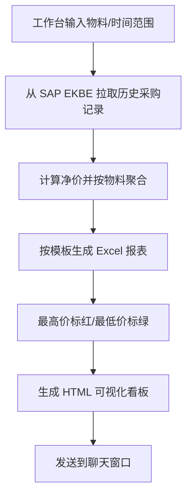

# 采购比价分析

面向制造业采购部门的历史采购价格分析工具。用户在工作台选择 SAP 连接、输入物料代码或短文本、设置时间范围，系统自动从 SAP EKBE 取数，生成结构化的 Excel 采购历史报表和 HTML 可视化看板，辅助采购人员快速掌握物料价格波动。

## 功能概述

1. **SAP EKBE 直连取数**：根据物料代码/短文本、时间范围，从 SAP EKBE 抓取历史采购记录
2. **净价自动计算**：净价 = 采购金额（DMBTR） / 采购数量（MENGE）
3. **模板化 Excel 输出**：按 `采购比价分析模板.XLSX` 生成，每物料一行，横向展开多笔采购时间与净价
4. **最高价/最低价颜色标注**：每行最高价红色背景、最低价绿色背景
5. **可视化 HTML 看板**：每个物料价格趋势折线图、整体箱线图、分布直方图
6. **多物料批量查询**：支持一次性输入多条物料代码或短文本
7. **时间范围自定义**：默认近两年，可手动设置起止日期

## 输入数据要求

### 必填参数（来自工作台 ERP 同步面板）

| 参数 | 说明 | 示例 |
|---|---|---|
| SAP 连接 | 已配置的 SAP RFC/ADO 连接 | `SAP_PROD` |
| 物料搜索 | 物料代码或短文本，支持多条 | `1000000048, 1000000049` 或 `470纱线` |
| 采购时间范围 | 起始日期 ~ 结束日期，默认近两年 | `2024-08-05 ~ 2026-08-05` |
| 最大返回行数 | 限制单条查询返回量，默认 1000 | `1000` |

### SAP EKBE 取数字段

| 字段 | 说明 |
|---|---|
| `MATNR` | 物料编码 |
| `BUDAT` | 凭证日期（采购时间） |
| `DMBTR` | 采购金额 |
| `MENGE` | 采购数量 |
| `WAERS` | 货币 |
| `LIFNR` | 供应商编码 |
| `EBELN` | 采购订单号 |
| `EBELP` | 采购订单行项目 |
| `BEWTP` | 历史记录类型（取收货相关类型，如 `'E'`） |

### 输出模板文件

- `assets/upload_templates/采购比价分析模板.XLSX`
  - 第 1 行合并标题：采购历史记录
  - 第 2 行表头：序号、物料代码、短文本、采购时间 1、采购时间 2、...
  - 第 3 行起：每行一个物料，横向填充对应采购时间的净价

## 核心工作流程



## 脚本说明

### fetch_ekbe_history.py - SAP EKBE 取数

**功能**：根据物料代码/短文本、时间范围从 SAP EKBE 查询历史采购记录。

**参数**：
- `--connection`: SAP 连接配置 ID
- `--materials`: 物料代码或短文本列表，逗号/换行分隔；纯数字物料代码脚本内部自动前导补 0 至 18 位
- `--start-date`: 起始日期 `yyyy-mm-dd`
- `--end-date`: 结束日期 `yyyy-mm-dd`
- `--max-rows`: 最大返回行数
- `--output`: 输出 JSON 文件路径

**输出 JSON 结构**：

```json
{
  "materials": [
    {
      "matnr": "1000000048",
      "maktx": "8TE098.S1HB TE470dtex140f",
      "records": [
        {
          "budat": "2024-10-15",
          "dmbtr": 24500.00,
          "menge": 1000.00,
          "net_price": 24.50,
          "waers": "CNY",
          "lifnr": "1000000001",
          "ebeln": "4500000001",
          "ebelp": "10"
        }
      ]
    }
  ]
}
```

### generate_excel_report.py - Excel 报表生成

**功能**：将 EKBE 聚合结果写入 `采购比价分析模板.XLSX`，每物料一行，横向展开采购时间和净价，并标注最高价/最低价。

**参数**：
- `--input`: EKBE 聚合结果 JSON 文件路径
- `--template`: Excel 模板路径
- `--output`: 输出 Excel 文件路径
- `--max-cols`: 时间轴最多展示多少列日期，默认 100

### generate_charts.py - HTML 可视化看板生成

**功能**：生成 HTML 看板，包含每个物料的价格趋势折线图、整体箱线图、分布直方图。

**参数**：
- `--input`: EKBE 聚合结果 JSON 文件路径
- `--output`: 输出 HTML 文件路径

## 关键规则

| 规则 | 说明 |
|---|---|
| 唯一数据源 | 仅 SAP EKBE，不再上传报价单、历史价模板、供应商档案 |
| 净价计算 | 净价 = `DMBTR` / `MENGE`；多币种按原币输出，不做汇率换算 |
| 采购时间 | 取 EKBE 的 `BUDAT`（凭证日期） |
| 时间范围 | 默认近两年；用户可自定义起止日期 |
| 物料搜索 | 支持物料代码精确匹配、短文本模糊匹配；多条输入用逗号/换行/空格分隔 |
| 物料号补零 | 纯数字物料代码在脚本层自动前导补 0 至 18 位（SAP 内部存储格式），再传入 EKBE 查询；前端保持用户原输入 |
| 颜色标注 | 每行最高价红色背景、最低价绿色背景 |
| 图表输出 | 每个物料生成一张价格趋势折线图；整体生成箱线图、分布直方图 |
| 结果格式 | Excel（按模板）+ HTML 可视化看板 |

## AI 执行步骤（必须按此顺序执行）

当用户在采购比价分析工作台点击「同步数据」，或在聊天窗口要求分析物料历史采购价时，按以下步骤执行。禁止跳过任何步骤，禁止从零编写 Python 脚本，必须调用本技能包提供的脚本。

### 步骤 1：从 SAP EKBE 拉取历史采购记录

根据用户输入的物料代码/短文本和时间范围，调用 `fetch_ekbe_history.py`。

```bash
python skills/procurement-comparison/scripts/fetch_ekbe_history.py \
  --connection "SAP_PROD" \
  --materials "1000000048,1000000049" \
  --start-date "2024-08-05" \
  --end-date "2026-08-05" \
  --max-rows 1000 \
  --output tmp/ekbe_history.json
```

### 步骤 2：生成 Excel 采购历史报表

按模板生成 Excel，并对每行最高价、最低价做颜色标注。

```bash
python skills/procurement-comparison/scripts/generate_excel_report.py \
  --input tmp/ekbe_history.json \
  --template "skills/procurement-comparison/assets/upload_templates/采购比价分析模板.XLSX" \
  --output tmp/采购比价分析结果.xlsx \
  --max-cols 100
```

### 步骤 3：生成 HTML 可视化看板

生成趋势图、箱线图、直方图等分析图表。

```bash
python skills/procurement-comparison/scripts/generate_charts.py \
  --input tmp/ekbe_history.json \
  --output tmp/采购比价分析看板.html
```

### 步骤 4：向用户汇报

1. 简要说明查询的物料数量、时间范围、数据来源
2. 展示每个物料的最高价、最低价、平均净价
3. 指出价格波动较大的物料
4. 提供文件路径：
   - Excel 报表：`tmp/采购比价分析结果.xlsx`
   - HTML 看板：`tmp/采购比价分析看板.html`

## 关键约定

- **禁止从零编写 Python 脚本**，所有计算必须调用本技能包脚本
- 所有脚本路径必须使用 `skills/procurement-comparison/scripts/` 下的文件
- 中间结果文件统一放在 `tmp/` 目录
- HTML 输出文件用于聊天框展示，Excel 输出文件用于下载
- 不处理供应商报价文件、不解析 PDF/Word/图片
- 颜色标注仅针对每行内该物料的历史净价

## 输出结果

### 1. Excel 采购历史报表

按 `采购比价分析模板.XLSX` 格式输出：

| 序号 | 物料代码 | 短文本 | 2024-10-15 | 2024-11-20 | 2025-03-08 | ... |
|---|---|---|---|---|---|---|
| 1 | 1000000048 | 8TE098.S1HB TE470dtex140f | 24.50 | 24.80 | 23.90 | ... |
| 2 | 1000000049 | 8TE098.S2HB TE470dtex140f | 25.10 | 24.60 | 24.00 | ... |

- 每行内最高价单元格：红色背景
- 每行内最低价单元格：绿色背景

### 2. HTML 可视化看板

- **价格趋势折线图**：每个物料一张，横轴为采购时间，纵轴为净价
- **箱线图**：展示所有物料净价分布
- **分布直方图**：展示采购频次或价格区间分布
- 适用于聊天框中直接展示

### 3. 汇总指标

- 每个物料的最高价、最低价、平均价、中位数
- 价格标准差（波动率）
- 最近一笔采购价

## 使用示例

```bash
# 1. 从 SAP EKBE 拉取近两年 1000000048 和 1000000049 的历史采购记录
python skills/procurement-comparison/scripts/fetch_ekbe_history.py \
  --connection "SAP_PROD" \
  --materials "1000000048,1000000049" \
  --start-date "2024-08-05" \
  --end-date "2026-08-05" \
  --output tmp/ekbe_history.json

# 2. 生成 Excel 报表
python skills/procurement-comparison/scripts/generate_excel_report.py \
  --input tmp/ekbe_history.json \
  --template "skills/procurement-comparison/assets/upload_templates/采购比价分析模板.XLSX" \
  --output output/采购比价分析结果.xlsx

# 3. 生成 HTML 可视化看板
python skills/procurement-comparison/scripts/generate_charts.py \
  --input tmp/ekbe_history.json \
  --output output/采购比价分析看板.html
```

## 数据对接建议

### ERP 对接字段

| 系统 | 表/接口 | 数据 |
|---|---|---|
| SAP | **EKBE** | 采购订单历史、收货记录、金额、数量、日期 |
| SAP | MARA/MAKT | 物料短文本 |
| SAP | LFA1 | 供应商名称 |
| U9 | （后续适配） | 采购历史记录 |

## 注意事项

1. **EKBE 数据量**：时间范围过大或物料过多时，建议分批次查询或限制 `max-rows`
2. **货币处理**：多币种按原币输出，不做汇率换算
3. **净价为零**：若 `MENGE` 为 0 或 `DMBTR` 为 0，跳过该条记录
4. **重复记录**：同一物料同一天多笔记录按实际笔数展开，不合并
5. **颜色标注**：仅对每行内的历史净价做最高价/最低价标注

## 目录结构

```
procurement-comparison/
├── SKILL.md                          # 技能主文档
├── scripts/
│   ├── fetch_ekbe_history.py         # 从 SAP EKBE 取数
│   ├── generate_excel_report.py      # 按模板生成 Excel 报表
│   └── generate_charts.py            # 生成 HTML 可视化看板
└── assets/
    └── upload_templates/
        └── 采购比价分析模板.XLSX      # Excel 输出模板
```

## 依赖安装

```bash
pip install openpyxl pandas matplotlib plotly
```

## 版本历史

- **v1.0.0**：初始版本，支持多供应商报价解析、比价矩阵、评分卡、议价建议、报告生成
- **v2.0.0**：改造为 SAP EKBE 历史采购价分析，输出模板化 Excel + HTML 可视化看板
