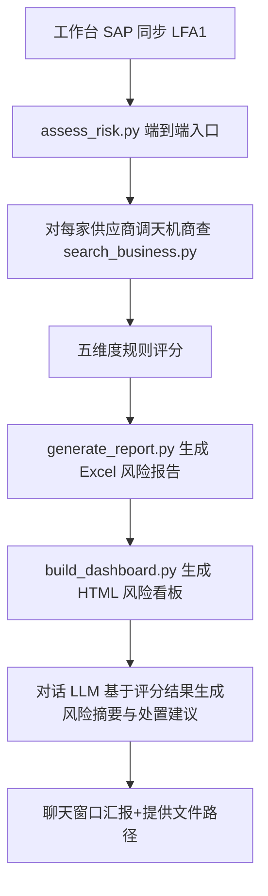

# 供应商风险预警（procurement-supplier-risk）

基于 SAP LFA1 供应商主数据 + 天机商查公开情报聚合，执行五维度风险评分，生成 Excel 风险报告与 HTML 风险看板。

## 设计原则（v3）

**脚本只做确定性计算，LLM 理解交给对话上下文。**

本技能在 Agent Harness 对话中被调用，对话 LLM 已在上下文里。脚本内不再重复调用 LLM，避免：
- 双重 LLM 调用导致的成本与延迟翻倍
- 脚本内 LLM 无对话上下文（如用户强调「重点关注财务风险」）
- 配置重复（脚本自解析 config.json，与 BotFactory 两套）

| 职责 | 归属 | 说明 |
|---|---|---|
| Web 搜索 + 抓取 | search_business.py（确定性） | 调 WebSearch/WebFetch 工具 |
| 规则评分 | scoring_rules.py（确定性） | 五维度加权计算 |
| Excel/HTML 报告 | generate_report.py / build_dashboard.py（确定性） | 模板化输出 |
| 风险摘要与处置建议 | **对话 LLM**（在 Agent Harness 上下文里） | 基于评分结果生成自然语言 |

## 功能概述

1. **SAP LFA1 供应商主数据读取**：从工作台 ERP 同步生成的 JSON 读取供应商编码、名称、统一社会信用代码、过账冻结、删除标记等
2. **天机商查风险搜索**：对每家供应商调用 `tianji-business-search` skill 搜索工商/司法/股东/舆情 4 维度
3. **五维度风险评分**：
   - 司法风险 40%（失信/被执行/诉讼/处罚/经营异常）
   - 股东与关联 20%（一人公司+小注册资本+注销/吊销）
   - SAP 内部 20%（LFA1 SPERR/LOEVM/创建时长）
   - 新闻舆情 10%（近 1 年负面关键词命中）
   - 工商信息 10%（经营状态+成立时长）
4. **风险等级**：低(<25) / 中(25-50) / 高(50-75) / 严重(≥75)
5. **风险摘要与处置建议**：由对话 LLM 基于评分结果 + key_risks 在聊天回复中直接生成（不落 JSON 文件）
6. **Excel 风险报告 + HTML 看板**：模板化输出，含风险分布、Top 高风险供应商列表

## 输入数据要求

### 必填：SAP LFA1 同步数据

工作台 ERP 同步面板生成的数据文件，支持 **CSV** 或 **JSON** 两种格式，脚本自动识别：
- CSV（推荐）：ERP 同步导出的原始格式，位于 `tmp/workbench/session_xxx/supplier_risk_erp_data.csv`
- JSON：`tmp/workbench/session_xxx/supplier_risk_lfa1_data.json`，格式 `[{...}, ...]` 或 `{"data": [...]}`

> 所有相对路径均以**租户工作空间**（工作目录）为基准，脚本会自动把相对路径锚定到租户工作空间，不会写入项目目录。

CSV 列名大小写不敏感，自动映射（以下任一均可）：

| SAP 字段 | 接受的列名（任一） | 示例 |
|---|---|---|
| LIFNR | `LIFNR` / `供应商编码` / `supplier_code` / `供应商代码` | `0000100001` |
| NAME1 | `NAME1` / `供应商名称` / `company_name` / `name` | `XX化工有限公司` |
| STCD1 | `STCD1` / `统一社会信用代码` / `credit_code` / `税号` | `91310000MA1K3X9X0X` |
| SPERR | `SPERR` / `过账冻结` / `posting_block` | `X` 或空 |
| LOEVM | `LOEVM` / `删除标记` / `delete_flag` | `X` 或空 |
| ERDAT | `ERDAT` / `创建日期` / `created_date` / `成立日期` | `20240101` |

> 空值列会被自动跳过，只有「供应商编码」和「供应商名称」是评估必需字段，其余可选。

## 核心工作流程



## 脚本说明

### assess_risk.py - 端到端风险评估入口

**功能**：读取 SAP JSON → 调天机商查 → 五维度评分 → 输出评估 JSON（不调 LLM）

**参数**：
- `--sap-json`: SAP LFA1 同步数据路径（必填，支持 CSV 或 JSON）
- `--tianji-dir`: 存放天机商查 JSON 的目录（可选，默认 `--sap-json` 所在目录）
- `--output`: 输出评估 JSON 路径（可选，默认 `--sap-json` 所在目录/supplier_risk_assessment.json）
- `--max-suppliers`: 单轮评估最大供应商数，默认 50

> 注：每次执行都重新搜索天机商查，不使用缓存，确保数据时效性。

**输出 JSON 结构**：

```json
{
  "meta": {
    "generated_at": "2026-08-18T...",
    "total": 10,
    "risk_distribution": {"低": 5, "中": 3, "高": 1, "严重": 1}
  },
  "assessments": [
    {
      "supplier_code": "0000100001",
      "company_name": "XX化工有限公司",
      "credit_code": "91310000...",
      "total_score": 75,
      "risk_level": "严重",
      "dimension_scores": {
        "judicial": 80, "shareholder": 60, "sap_internal": 60, "news": 40, "business": 25
      },
      "key_risks": ["2024-05 被列为被执行人，执行标的 50 万元", ...],
      "sap_flags": {"posting_block": "X", "delete_flag": ""},
      "ai_summary": "",
      "ai_recommendation": "",
      "priority_actions": [],
      "tianji_path": "tmp/workbench/session_xxx/tianji_0000100001.json"
    }
  ]
}
```

> **注**：`ai_summary` / `ai_recommendation` / `priority_actions` 留空，由对话 LLM 基于评分结果 + key_risks 在聊天回复中生成。

### scoring_rules.py - 五维度评分规则

**司法 40%**：被执行人(15分/次) + 失信(25分/次) + 诉讼(5分/次) + 处罚(10分/次) + 异常(10分/次)
**股东 20%**：一人公司(+25) + 小注册资本(+30) + 注销/吊销(=100)
**SAP 内部 20%**：过账冻结(+60) + 删除标记(+80) + 成立<1年(+20)
**舆情 10%**：负面关键词命中(15分/次)
**工商 10%**：注销/吊销(=100) + 无状态(+25) + 成立<3年(+15)

### ai_recommendation.py - 规则兜底模板（已废弃 LLM 调用）

原实现调用 OpenAI 生成风险摘要，v3 起已移除。assess_risk.py 不再加载本模块，`ai_*` 字段留空由对话 LLM 填充。本文件保留 `generate_recommendation()` / `_fallback_recommendation()` 作为向后兼容的规则兜底模板，无外部引用时可安全删除。

### generate_report.py - Excel 风险报告

按 `assets/templates/供应商风险报告模板.xlsx` 生成 Excel，每供应商一行，含所有评分维度+风险事件+建议。

### build_dashboard.py - HTML 风险看板

生成 HTML 看板，包含：风险等级分布饼图、Top 10 高风险供应商条形图、各维度评分热力图。

## AI 执行步骤（必须按此顺序执行）

当用户在风险预警工作台点击「开始风险评估」，或在聊天窗口要求批量评估供应商风险时，按以下步骤执行。禁止跳过任何步骤，禁止从零编写 Python 脚本，必须调用本技能包提供的脚本。

### 步骤 1：读取工作台 SAP 同步数据

确认 SAP LFA1 同步数据路径（CSV 或 JSON，通常位于 `tmp/workbench/{session_id}/supplier_risk_erp_data.csv`，即工作台上传到会话目录的文件，取提示词中 `{{FILE_PATH}}` 的绝对路径）。若不存在，提示用户先在工作台点击「同步 ERP」。

> 会话目录：`{租户工作空间}/tmp/workbench/{session_id}/`。本次评估的全部中间与结果数据都会落在这个目录里，与比价分析一致——不同会话各占各的目录，互不覆盖。

### 步骤 2：执行风险评估

```bash
python skills/procurement-supplier-risk/scripts/assess_risk.py \
  --sap-json tmp/workbench/session_xxx/supplier_risk_erp_data.csv \
  --max-suppliers 50
```

脚本内部会：
1. 读取 SAP 同步数据（CSV 或 JSON）中每家供应商
2. 对每家供应商调用 `tianji-business-search/scripts/search_business.py` 搜索（每次都重新搜索，不使用缓存）
3. 执行五维度评分
4. 输出汇总评估 JSON 到 `--sap-json` 所在目录（会话目录）下的 `supplier_risk_assessment.json`（`ai_summary` / `ai_recommendation` / `priority_actions` 留空）

### 步骤 3：生成 Excel 风险报告

```bash
python skills/procurement-supplier-risk/scripts/generate_report.py \
  --input tmp/workbench/session_xxx/supplier_risk_assessment.json \
  --template skills/procurement-supplier-risk/assets/templates/供应商风险报告模板.xlsx
```

`--output` 可省略，默认输出到 `--input` 所在目录（会话目录）下的 `供应商风险预警报告.xlsx`。

### 步骤 4：生成 HTML 风险看板

```bash
python skills/procurement-supplier-risk/scripts/build_dashboard.py \
  --input tmp/workbench/session_xxx/supplier_risk_assessment.json
```

`--output` 可省略，默认输出到 `--input` 所在目录（会话目录）下的 `供应商风险看板.html`。

### 步骤 5：对话 LLM 生成风险摘要与处置建议

**本步骤由对话 LLM 在 Agent Harness 上下文里完成，不调用脚本。**

基于评估 JSON 中的：
- `risk_level` / `total_score` / `dimension_scores`（风险等级与评分）
- `key_risks`（关键风险事件）
- `sap_flags`（SAP 内部标记）

对话 LLM 直接在聊天回复中生成：
1. **风险摘要**：一句话概括供应商风险状况（含关键数字）
2. **处置建议**：具体行动（如限制采购/要求担保/暂停合作）
3. **优先行动**：最多 3 条具体措施

### 步骤 6：向用户汇报

1. 简要说明评估的供应商总数、风险等级分布（低/中/高/严重）
2. 列出 Top 3 高风险供应商 + 关键风险点
3. 给出总体处置建议（如"XX化工存在失信记录，建议限制采购"）
4. 提供文件路径（均位于本次**会话目录** `tmp/workbench/{session_id}/` 下）：
   - Excel 报告：`tmp/workbench/session_xxx/供应商风险预警报告.xlsx`
   - HTML 看板：`tmp/workbench/session_xxx/供应商风险看板.html`

## 关键约定

- **禁止从零编写 Python 脚本**，所有计算必须调用本技能包脚本
- **每次执行都重新搜索**：不使用缓存，不跳过已评估过的供应商，确保数据时效性
- **每次必须调用搜索**：无论知识库或历史评估是否有记录，都必须重新执行 assess_risk.py 获取最新搜索数据
- **知识库/历史评估仅作为参考**：可与本次搜索结果结合使用，补充上下文。当知识库/历史记录与本次搜索结果冲突时，**以本次搜索结果为准**（搜索数据时效性更高）
- **搜索失败时的处理**：若评估结果中 `tianji_extracted: false`，必须如实说明"天机商查未返回数据"，此时可参考知识库/历史评估记录给出有限结论，但需明确标注"基于历史参考，未获得最新公开数据"
- 所有脚本路径必须使用 `skills/procurement-supplier-risk/scripts/` 下的文件
- **会话隔离存储**：中间结果与最终报告统一落在输入数据所在目录（工作台会话目录 `tmp/workbench/{session_id}/`），与比价分析一致，不同会话互不覆盖；脚本会把相对路径自动锚定到租户工作空间，禁止写入项目目录或系统临时目录
- HTML 输出文件用于聊天框展示，Excel 输出文件用于下载

## 目录结构

```
procurement-supplier-risk/
├── SKILL.md
├── scripts/
│   ├── assess_risk.py            # 端到端入口
│   ├── scoring_rules.py          # 五维度评分规则
│   ├── ai_recommendation.py      # LLM 风险摘要与处置建议
│   ├── generate_report.py        # Excel 报告生成
│   └── build_dashboard.py        # HTML 看板生成
└── assets/templates/
    └── 供应商风险报告模板.xlsx
```

## 依赖安装

```bash
pip install openpyxl pandas matplotlib plotly
```

> 注：v3 起不再需要 `openai` 库（脚本不调 LLM）。

## 上游依赖 skill

- `skills/tianji-business-search/`：本 skill 通过 subprocess 调用其 `scripts/search_business.py`，获取供应商公开风险信息（v3 起天机商查脚本也不调 LLM，只做搜索+规则提取）

## 注意事项

1. **天机商查限流**：单供应商最多搜 4 维度（basic+risk+shareholder+news），50 家供应商最多 200 次搜索
2. **不使用缓存**：每次执行风险分析都重新调用天机商查搜索，确保数据时效性
3. **规则提取精度**：search_business.py 用关键词+正则提取风险指标，精度有限但够用（评分用 min() 截断，对量级不敏感）；对话 LLM 可基于 `raw_search_results` 做更准确判断
4. **SAP 字段兼容**：评分脚本同时兼容 SAP 原始字段名（LIFNR/NAME1/SPERR）和 ADT SQL 别名（supplier_code/company_name/posting_block）
5. **风险等级阈值**：低(<25) / 中(25-50) / 高(50-75) / 严重(≥75)，可在 scoring_rules.py 调整
6. **LLM 调用边界**：脚本不调 LLM，风险摘要与处置建议由对话 LLM 基于评分结果生成，避免双重调用
