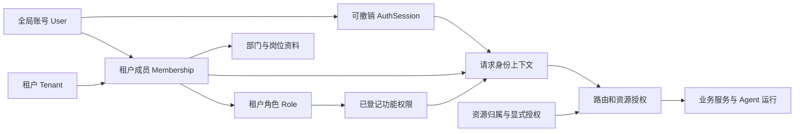

# CowAgent 与 OneAgent 用户、角色权限对比及实现方案

## 2026-09-15 方案变更（已复核，2026-09-16）

本文保留首次对比与阶段计划。控制台准入、本人资源维护、用户默认和菜单结构按新方案调整：两类用户共用现有功能，仅数据范围不同；组织与权限及公共配置保留管理员边界，删除“我的资源”及五项入口。本次不重新审计 OneAgent，不将旧测试计数解释为新方案验收。

最新方案：[统一控制台与数据范围方案](unified-console-access-plan.md)；实施契约：[unify-console-by-data-scope](../../openspec/changes/unify-console-by-data-scope/proposal.md)。

**实际状态**：本文 §3 的身份安全与授权收口（A/B）已实现并有既有证据；§3.3 的资源授权与模型策略中，
grants/平台 all 已实现，**成员模型目录已在 2026-09-16 快照内实现（未验收）**——`admin.models` 页 scope 由
`platform` 改为 `tenant`（`auth/service.py:103`）、新增 `model_catalog_open()`（`:3393`），用例 29 项 + 前端 7 项通过；
**高级模型策略（`model_policies`）仍为规划**；§5.2 SSO、Desktop 企业适配、
新增 CLI 账号操作仍是规划。本 change 补上的是「控制台准入 + 对象范围 + 用户默认 + 菜单迁移」四件事，
不改变本文对身份底座的结论。逐项判定见
[`evidence/8-5-doc-closure.md`](../../openspec/changes/unify-console-by-data-scope/evidence/8-5-doc-closure.md) §2。

---


日期：2026-09-08。范围：两个本地项目的当前工作区源码，包括未提交文件；不代表已部署版本。OneAgent 以静态代码审计为主，CowAgent 另做临时数据库验证和精选测试。本次产出设计方案，未实施下文产品改造。

> 后续复核：本报告保留首次源码快照与 A～D 长期方向。对应 change 已收口为 A/B 身份安全和管理闭环，资源授权、模型策略、运行消费者、SSO、Desktop 企业适配及新增 CLI 账号操作明确延期。聊天 handler 已有后续归属校验，原 63/6 测试结果不代表当前状态；最新复核的 92 项选定测试通过，但不证明完整运行时可用。执行范围、取舍与证据见[change 复核记录](/Users/jiantan/ai_assistant/cowagent/openspec/changes/complete-enterprise-identity-access-control/review.md)。

**结论：CowAgent 已有适合企业团队的身份底座，OneAgent 的优势在业务权限覆盖和账号管理的操作闭环。建议保留 CowAgent 的 User → Membership → 租户角色模型、SQLite 会话和组织关系，参考 OneAgent 补业务授权；首先修正现有鉴权和管理操作缺口。**

## 1. 实际能力对比

“具备”指找到实现；“部分”包括后端已有但 UI 未接通，或覆盖不完整。权限点数量只说明目录范围，不代表实现质量。

| 能力 | OneAgent | CowAgent 当前工作区 | CowAgent 后续工作 |
| --- | --- | --- | --- |
| 账号密码登录、本人改密、退出 | 有，HMAC token、撤销记录 | 有，PBKDF2、随机会话、仅存 token 摘要、按用户撤销 | 保留底座；补临时密码到期执行及所有入口一致鉴权 |
| 用户管理 | 用户增改删、启停、多角色、管理员改密码、搜索 UI、用户 CLI | 有新建账号/租户成员、成员启停及资料编辑；缺全局账号状态维护和管理员重置密码的完整服务/API/UI | 补平台账号控制面；优先停用，暂不增加物理删除 |
| 同账号加入多个租户 | User 仅有一个 tenant_id；默认新用户配独立 tenant | User 与 Membership 分离，同账号多租户；有按标签选择租户 | 保留；补“绑定已有账号”的 UI |
| 租户生命周期 | 有 Tenant、目录、查询；未见完整租户 CRUD 管理台 | 有平台租户创建、列表、启停、管理员配置后端；UI 缺管理员配置及改名 | 补闭环，不复制“一用户一租户” |
| 角色与多角色 | 内置 admin/user，自定义角色 CRUD、权限并集 | 内置 tenant_admin/member，租户内自定义角色、权限并集、内置/在用保护 | 修成员角色回显；补角色复制、成员关联及权限分组 |
| 功能权限目录 | 54 项，覆盖聊天、Agent、工具、技能、模型、MCP、知识、任务、审计及业务场景 | 9 项：租户信息/成员/组织、Agent/历史/知识/记忆读取、待办读写 | 按已适配业务逐项增加使用、维护等权限 |
| 权限到 API 的落实 | 多个业务 handler 调用集中权限函数；仍有前后端口径及委派问题 | 新接口部分接入，旧接口仍存在仅检查登录、沿用 legacy 鉴权的路径 | 先统一路由门禁，功能权限和资源范围均由后端执行 |
| 技能授权 | 用户级 skill_permissions、授权 API、技能过滤/同步 | 未见对应租户角色/成员技能授权闭环；执行模式不是角色权限 | 增加角色/成员可用技能范围，执行时重验 |
| 场景分类授权 | 场景 required_permission、分类权限、场景到技能的映射 | 未见同等场景授权体系 | CowAgent 上线对应场景时再登记；不搬空模块 |
| 用户/角色模型分配 | 策略存储、管理 API、运行时匹配 | 未见按租户角色/成员配置模型策略的闭环 | 将模型可用范围与默认模型选择分开实现 |
| 组织架构 | department 文本，非组织树 | 部门树模型、单部门、岗位文本及引用校验；UI 仍平铺 | 修新建入口、树展示、成员联动；保留单部门方案 |
| 部门数据权限、多部门任职 | 本次未发现通用实现 | 现设计明确不提供 | 属于额外产品扩展，不算 OneAgent 已有而 CowAgent 缺失 |
| 个人/租户数据隔离 | 租户目录、会话/审计分区；缺上下文会回退全局 | 有租户 Agent 绑定、私有 owner、可信目录及受控读取 | 保留，覆盖到全部新开放业务路径 |
| 企业 SSO | 钉钉登录/扫码重置；以昵称匹配账号，需重设计身份绑定 | 未见企业登录接入 | 用稳定外部身份绑定本地 User，随后验证 Membership |
| 审计 | 用户/角色、认证、工具执行及过滤查询，覆盖仍不完整 | 有身份写入同事务审计、追加保护和查询 API；读权限有缺口 | 先修查询授权，再补拒绝事件、业务事件和管理页面 |
| 企业模式下聊天、文件、调度等 | 多项业务已结合 RBAC 运行 | 聊天/流/文件等明确关闭；部分旧接口又未统一关闭 | 按业务逐项验收开放，不能直接撤掉 503 保护 |
| Desktop / CLI | 用户 CLI 有 list/create/delete/reset-password；本次未比较其桌面产品 | Desktop 仍密码式 legacy 接入；CLI 主要 bootstrap/register | 桌面补账号、租户和权限上下文；CLI 先补必要运维能力 |

CowAgent 的 `agent.permission` 和 Desktop `permission.ts` 中 `read-only/workspace-write/full-access` 控制 Agent 执行方式，不能替代“谁可以使用哪个功能、读取谁的数据”的用户授权。

## 2. 先补现有缺口

以下不是根据页面猜测的功能愿望，而是源码或隔离验证发现的问题。

| 编号 | 发现与证据 | 处理要求 |
| --- | --- | --- |
| G01 / P0 | `_check_auth()` 先判 legacy 免密/共享 token，后判数据库会话；`build_web_app()` 没有统一权限 processor。临时配置下 database + 空 web_password，匿名 GET `/api/models` 返回 200；设置 web_password 后，无权限账号不带租户头仍返回 200 | database 认证分支优先且独立；建立方法+路由登记，未适配业务关闭，拒绝未登记入口 |
| G02 / P0 | `IdentityAuditHandler` 对任意有效租户成员放行；普通 member GET 审计返回 200。`TenantInfoHandler` 未校验 tenant.info.read，空权限角色也能读租户原始行，含 shared_root | 审计先限平台/本租户管理员；租户资料校验权限并采用返回字段白名单 |
| G03 / P0 | 管理写 handler 未统一调用 Cookie 来源/CSRF 校验；Cookie 取凭据与 Bearer 豁免来源检查的判断不一致；`login()` 未校验 temp_password_expires_at，未见登录失败限流；拒绝审计函数未形成统一调用链 | 统一实际凭据选择和管理写检查；验证临时凭据到期；增加可配置登录限流及拒绝审计。此项为静态发现，实施时补行为测试 |
| G04 / P0 | 成员列表不返回已有角色；编辑框 roles 默认空；`update_member()` 删除原绑定并把空数组当 member。只改姓名/岗位可能意外移除自定义角色 | 返回并回显当前角色；未提交 roles 保留原绑定，显式空数组返回 400；无业务权限需求使用空权限自定义角色，不能静默补 member |
| G05 / P1 | 有 list_platform_users，但没有平台用户维护/重置密码完整 API；`_set_password_for_user` 是内部辅助方法，不能直接当管理员重置接口 | 补鉴权、近期验证、版本控制、最后管理员保护、撤销目标账号全部会话、审计的完整事务 |
| G06 / P1 | 用户 UI 固定 create-new；部门新建按钮初始 hidden 且无显示逻辑；搜索/部门筛选无绑定；成员固定第一页 100 条 | 接入已有账号绑定、可用的新建入口、搜索筛选和真实分页 |
| G07 / P1 | 租户管理员配置未接 UI、租户名称锁定；组织平铺；角色无复制/关联成员；只读成员也可能看到管理按钮 | 按后端下发能力显示入口；补租户资料、树及角色管理交互 |
| G08 / P1 | database UI 默认聊天并启动轮询，后端聊天返回 503；文档称首期只读，另有聊天开放测试 | 统一当前发布边界：只读/管理首页、不可用原因、测试及设计一致；运行能力另阶段接入 |
| G09 / P1 | `cow management register --admin-username` 未实际用于选择归属人，而取第一位平台管理员 | 精确解析指定账号并验证租户资格；迁移归属不可依列表排序决定 |

旧配置、模型、Agent 写入、调度、工作区写入、会话修改等还存在只用 `_require_auth()` 的候选路径，需要逐项登记验证。此次仅对上述 GET 做隔离复现，未调用真实系统写接口，也不将所有静态候选描述为已复现漏洞。

## 3. 沿用的架构和授权规则

继续使用 Python/web.py、SQLite、原生 Web JS 及既有 React Desktop；不新增认证服务器、微服务或第二份 JSON 身份库。



一次业务调用须同时满足：有效会话、有效租户成员关系、功能权限、资源可见范围；涉及工具执行时再满足执行策略与动作审批要求。

- 平台管理员处理全局账号与租户生命周期，不因平台身份自动取得租户业务数据访问权。
- tenant_admin 管理本租户成员、角色和组织。首批仍由内置管理员负责身份写入，避免引入普通角色可无限授予权限的问题。
- 普通成员从当前租户多个角色取得权限并集。角色增删立即影响下一次请求，不能把登录时的权限当作长期凭证。
- 部门只是组织归属，移动部门不隐式增加业务权限。后续若需要部门数据范围，单独设计和迁移。
- Agent/会话/知识/待办的既有 owner 与租户校验继续生效。页面看不见不等于 API 安全，资源 ID 存在也不等于有权操作。

### 3.1 收口 HTTP 鉴权

新增小型 `auth/http_policy.py`，在 `build_web_app()` 安装请求 processor；同时将 `WebChannel.startup()` 中直接创建 `web.application(...)` 的实际服务启动路径改为复用该工厂，避免只保护测试/开发入口。复用 `auth/runtime.py`，不另建线程上下文。处理顺序：

1. 按实际匹配 handler、HTTP method 登记 public/personal/platform/tenant/closed；未知路由仍按 HTTP 路由规则返回 404，已存在但未登记的业务方法禁止执行。
2. database 模式仅接受有效数据库会话 Cookie 或 Authorization header；旧共享 token、query token、web_password 为空均不能赋权。两种凭据同时出现时明确拒绝混用；只有实际由有效 Bearer 认证的请求才可豁免 Cookie 来源校验，不能因为带 Bearer 字样就豁免。
3. 校验强制改密状态、请求来源和所需身份域。受限会话只可读取最小自身信息、改密、退出，不能访问平台接口。
4. tenant 路径验证 `X-Tenant-ID` 对应的有效成员资格，再检查权限点。平台与个人接口不依赖任意残留租户头，避免被客户端上次选择影响。
5. handler/service 检查具体资源范围；列表先过滤后分页，总数使用相同过滤条件。身份写入事务内重验操作者资格、对象版本、同租户引用及管理员不变量。
6. finally 清理请求上下文；线程/任务通过既有 RuntimeIdentity 的 submit/wrap 传递，禁止回退全局默认身份。

返回约定：缺会话 401，缺租户选择 400，无权限 403，版本或引用冲突 409，身份库故障/明确未开放能力 503；资源不存在或不在可见范围统一采用既有不暴露存在性的约定。

### 3.2 功能权限目录

保留现有 9 个权限 ID，按模块追加有限目录；新权限不能因升级自动授予所有 member。借鉴 OneAgent 的集中目录和管理/使用区分，不照搬其全部业务域或 admin 无条件放行。

| 模块 | 建议增量权限示例 | 适用边界 |
| --- | --- | --- |
| 聊天与运行 | chat.use、run.read、run.cancel | 仅本人/明确授权会话；取消操作还校验 run owner |
| Agent | agent.use、agent.manage | agent.read 不自动赋予执行权；维护限本租户绑定资源 |
| 技能与工具 | skill.read、skill.use、skill.manage、tool.execute | 功能权限与具体可用技能/工具范围共同生效 |
| 知识与记忆 | knowledge.write、memory.write | 沿用已有读取 ID；个人资料仍遵守 owner |
| 文件 | file.read、file.write | 可信目录、资源归属与路径校验；不接受任意绝对路径 |
| 模型 | model.use、model.policy.manage | 可用模型与默认选择策略分开；全局供应商凭据仍属平台控制面 |
| 调度 | scheduler.read、scheduler.manage、scheduler.run | 任务持久化租户/创建者，触发时重验资格 |
| 审计 | identity.audit.read、business.audit.read | 后续需要只读审计员才放入可分配目录；首批继续管理员专管 |
| MCP、通道及系统配置 | 按实际资源归属登记对应管理权限 | 未形成租户资源前按平台控制面或关闭处理，不能只给 tenant_admin 加一个全局写权限 |

权限目录增量提供 `id/group/label/description/scope/assignable` 元数据。后端返回 `effective_permissions` 与管理资格，Web/Desktop 使用同一结果；不在前端独立实现权限推导。首批不引入通配符；如某维护权限需要包含读取，应在一个后端函数显式展开，且管理权限不默认包含高风险执行权。

当前 `_admin_permissions()` 会把完整目录赋给 tenant_admin。扩目录前必须修改该函数与 `permissions_for_roles()`：管理员资格仍单独决定身份管理权，业务权限改用内置角色显式默认集合。既有 9 项权限保持兼容，新增执行权限须明确授权；不能仅追加目录就自动开放所有租户管理员的工具执行。

### 3.3 资源授权、技能和模型

第一阶段继续使用现有 Agent 私有/租户共享模型；需要“某个角色只能用指定技能或模型”时，才增加精确授权记录：

| 新数据 | 最少字段 | 说明 |
| --- | --- | --- |
| role_resource_grants | tenant_id、role_id、resource_type、resource_id、action、version | 先限实际需要的 agent/skill/model 类型；同租户角色外键及唯一约束 |
| membership_resource_grants | tenant_id、membership_id、resource_type、resource_id、action、version | 支持 OneAgent 的逐用户授权需求，但绑定租户成员而非全局 User |
| model_policies | tenant_id、目标成员或角色、priority、模型资源 ID、version | 只存模型引用和选择规则，凭据继续在现有配置归属层 |

授权规则采用允许集合，角色与成员授权取并集，然后与功能权限、资源归属、平台执行上限取交集；首批不加入 deny 优先级和复杂委派。既有读取保留明确的 owner/租户共享基线；启用资源级授权后的 agent.use、skill.use、model.use 没有有效 grant 即拒绝，不把“没有记录”解释成全部可用。删除最后一条有效 grant 后下一请求拒绝；若另一个角色仍赋予相同权限，应显示其授权来源。

每种资源切换前生成原允许集合的迁移清单，保留既有读取，不把当前关闭的执行能力推断为已授权；新增执行范围由管理员明确配置后再开放。私有资源仍遵守既有 owner/管理员策略，不能因有 role grant 意外将私有历史或待办共享。

模型选择建议顺序：合法的当前会话显式选择 → 成员策略 → 角色策略（显式 priority，相同优先级冲突拒绝保存）→ 租户默认。每层候选都必须在允许模型集合内；用户提交的非法模型直接拒绝。模型默认路由策略不等同模型授权，更不等同调用硬配额。

技能在目录、提示词/工具装配及实际执行处复用同一判断；不能只复制/删除租户目录文件来控制权限。CowAgent 后续有场景时，可借鉴 OneAgent 的场景权限映射技能，但权限依赖须明确登记，不能从场景说明文本推断授权。

## 4. 管理功能的接口与页面落点

保持现有四个菜单。用户页给平台管理员增加“全局账号”页签，租户成员仍在当前租户维护；避免把停用租户成员误当停用全局账号。

| 接口/页面 | 实现要求 |
| --- | --- |
| 新增 GET `/api/platform/users` | 平台管理员；搜索、状态、分页；只返回账号管理必要字段 |
| 新增 PATCH `/api/platform/users/{id}` | 全局启停/平台管理员标识；近期验证、expected_version、最后管理员约束；全局停用检查关联有效租户管理员连续性 |
| 新增 POST `/api/platform/users/{id}/reset-password` | 平台管理员；服务端生成限期临时密码、仅展示一次、强制改密、撤销该账号全部会话、事务审计 |
| 补平台租户详情及 `/{id}/admins` 页面调用 | 名称编辑、启停、指定有效管理员；目录由服务端按配置生成，普通表单不要求管理员填写服务器 shared_root |
| 完善 `/api/tenant/members` | create-new / bind-existing 显式选择；已有账号绑定不改变全局密码；返回 role_codes，支持搜索/部门/状态/分页 |
| 完善 `/api/tenant/members/{id}` | 编辑回显；区分未改角色与显式更换角色；版本冲突重载，部门变更不修改角色 |
| 完善 `/api/tenant/roles` 和权限目录 | 权限分组/说明、角色成员数、复制角色（先读取后创建即可）、内置只读、在用删除保护 |
| 完善 `/api/tenant/departments` | 真正树视图、创建入口、部门成员筛选、父级移动、排序；避免回环和跨租户引用 |
| 完善 `/api/identity/audit` | 明确平台/租户范围，筛选时间/动作/结果/操作者及分页；页面只给已授权身份 |
| 增量 GET `/auth/context` | 基于既有 `/auth/me`，返回所选租户的有效权限、管理资格及已开放功能；作为渲染依据，后续请求仍重验 |

HTTP 层使用现有 `auth_handlers.py`、`admin_handlers.py`；事务规则放 `auth/service.py`；表迁移放 `auth/store.py`；页面主要落在 `identity-admin.js`、`console.js`、`chat.html`。不为四个菜单再建独立管理前端。

管理入口的可见性由账号上下文决定；进入页面、按钮与 API 的权限语义一致。切换租户覆盖未保存表单提示、请求取消、generation 丢弃晚响应、缓存清理和首页选择。未开放能力显示明确原因且不启动后台轮询。

## 5. 运行能力与企业登录分阶段接入

### 5.1 聊天、文件、任务和 Desktop

聊天开放必须同时完成 `/message`、`/stream`、`/poll`、`/cancel` 的资源关系校验，不能仅把 `MessageHandler` 的 503 删除。运行归属固定为 `(tenant_id, user_id, agent_id, session_id, run_id)`；客户端不能伪造 owner，跨线程只传已验证上下文。

长连接需在建立、恢复和持续发送期间重验会话与授权；采用带 Cookie/header 的流式请求，禁止 URL 长效 token。撤权阻止后续输出/操作并终止可取消运行，已经发生的外部副作用不能宣称可回滚。工具调用还要受 Agent 执行模式、凭据范围及动作审批约束，不能让用户选择 full-access 绕过组织授权。

文件、OpenAI API、外部通道、调度依次独立接入；每个消费者具备明确身份来源、数据范围、撤权规则和审计后再开放。沿用既有设计中涉及凭据、外部动作审批、配额和执行隔离的验收条件，本轮不把这些复杂能力折算成几条 RBAC 权限。

Desktop 增加用户名、改密、租户选择，普通请求附租户头；更新登录结果类型、退出清理及鉴权失败界面。可先使用 Web 管理页完成管理操作，桌面优先打通登录与业务上下文。CLI 的 bootstrap/register 保留维护用途，先修指定管理员归属；新增重置密码等命令须明确本机运维权限边界，不接受任意用户名即提权的远程接口。

### 5.2 SSO

新增 external_identities：`provider + issuer/corp_id + subject` 唯一绑定 User，记录创建/最后登录时间；只有可信管理员绑定或用户已登录后确认绑定。企业扫码得到外部身份后仍走本地账号状态、Membership、AuthSession 及强制改密/企业策略检查。

登录事务使用短期一次性 state 并与浏览器发起过程绑定，回调验证后消费；重放、企业不匹配、重名、未绑定身份都不能接管已有账号。展示昵称仅用于显示，不能用于账号匹配。SSO 不自动增加 platform_admin 或 tenant_admin。

## 6. 交付顺序与验收

| 阶段 | 交付范围 | 完成标志 |
| --- | --- | --- |
| A：权限边界修复 | G01～G04、G08 的当前发布语义、G09；统一认证/路由、数据白名单、管理写保护、临时密码校验 | 匿名/旧 token/无权限用户不能调用未授权 API；普通成员不可读审计；只改成员资料不改变角色；关闭消费者不可触发 |
| B：账号管理闭环 | 平台账号维护/重置密码，成员绑定、查询分页，租户管理员配置，角色复制、组织树及权限感知 UI | 两租户、多个账号走真实浏览器操作完成；超过 100 成员可查；只读用户不出现管理入口；事务并发与审计回滚通过 |
| C：业务授权 | chat/Agent/技能/模型权限与必要资源 grants，逐消费者运行、文件及调度接入 | 菜单、API、工具执行三处同口径；跨租户/跨成员拒绝；长连接和任务撤权生效；未适配业务仍关闭 |
| D：企业与多端 | SSO、Desktop 企业登录、按实际需求补 CLI 与审计运营 | 稳定外部身份绑定；Web/Desktop 同账号权限一致；SSO 重放/重名测试通过 |

A、B 是本次用户/角色权限建设最优先的实施包。C 按业务逐个交付，D 可在身份底座稳定后并行设计。部门数据范围、多部门、邀请/自助注册、MFA、通用 IAM 委派均不作为“追齐 OneAgent”的默认范围。

验收至少覆盖：

1. **路由覆盖**：遍历真实 `_WEB_URLS` 每个已实现 method，必须有明确策略；包括 POST/PUT/DELETE、别名、文件、流、后台启动和间接调用。
2. **身份和跨租户**：匿名、旧 token、临时密码已到期、强制改密、停用账号/成员/租户、平台身份无 Membership、A 租户 ID 访问 B 资源。
3. **角色与资源**：零业务权限的自定义角色、内置角色保护、仅改名保留角色、并发降权/停用最后管理员；目录新增权限不自动授予管理员；无资源 grant/删除最后 grant 拒绝，多个来源的授权解释一致。
4. **真实交互**：创建/绑定、分页搜索、部门创建/移动、角色复制、只读入口、切租户未保存表单、A→B→A 晚响应。
5. **写入和审计**：来源检查、有效 Cookie + 无效 Bearer + 跨来源仍被拒绝、登录失败限流、审计失败事务回滚、凭据脱敏、所有状态变更撤权效果、身份审计越权拒绝。
6. **兼容与迁移**：保留现有 User/Membership/角色 ID；旧角色权限不扩大；新增权限默认未授予；维护窗口备份后执行版本化 SQLite 迁移；回退相容代码或完整快照，不通过切 legacy 绕过新权限。

## 7. 本次验证与现有文档偏差

执行以下精选测试，结果 **63 passed / 6 failed**，耗时约 19.5 秒：

```sh
.venv/bin/python -m pytest -q \
  tests/test_identity_policy.py \
  tests/test_identity_auth_security.py \
  tests/test_identity_web_handlers.py \
  tests/test_revocation_takes_effect.py \
  tests/test_web_consumer_closure.py \
  tests/test_chat_identity_context.py \
  tests/test_todo_web_database.py
```

6 项失败均位于 `test_chat_identity_context.py`：测试期望聊天成功或返回 400/401/403，实际在 `_guard_not_database()` 处返回 503。现有关闭消费者测试同时通过，说明当前测试/注释/发布边界相互冲突；不能据此直接放开运行，也不能把这轮结果写成“全部通过”。这些测试不是全仓回归或部署验收。

另使用独立临时 IdentityService 和真实路由、隔离配置/模型下游执行 GET，验证 G01/G02；未对真实账号或业务资源进行写操作。OneAgent 本次未运行真实服务或测试。

现有 `add-tenant-identity-access-management` 中 proposal 仍写只改文档/任务未勾选，tasks 大部分已经勾选，design 的 7 个权限也落后于实际 9 个。实施开始时应对照实际代码更新基线、重开未达验收项；本报告不代为修改这些任务状态。工作区扫描期间其他改动仍在发生，源码行号可能移动，实施前按函数名再次核对。

## 8. 主要源码依据

CowAgent：

- [权限目录与权限并集](/Users/jiantan/ai_assistant/cowagent/auth/policy.py:22)、[身份/成员/角色等表结构](/Users/jiantan/ai_assistant/cowagent/auth/store.py:77)、[请求上下文](/Users/jiantan/ai_assistant/cowagent/auth/runtime.py:71)。
- [密码实现](/Users/jiantan/ai_assistant/cowagent/auth/password.py:50)、[可撤销会话](/Users/jiantan/ai_assistant/cowagent/auth/session.py:46)、[登录与临时密码检查落点](/Users/jiantan/ai_assistant/cowagent/auth/service.py:459)。
- [legacy/database 鉴权顺序](/Users/jiantan/ai_assistant/cowagent/channel/web/web_channel.py:253)、[管理 API](/Users/jiantan/ai_assistant/cowagent/channel/web/admin_handlers.py:64)、[审计查询授权](/Users/jiantan/ai_assistant/cowagent/channel/web/admin_handlers.py:395)。
- [成员列表](/Users/jiantan/ai_assistant/cowagent/auth/service.py:845)、[成员更新](/Users/jiantan/ai_assistant/cowagent/auth/service.py:972)、[成员编辑表单](/Users/jiantan/ai_assistant/cowagent/channel/web/static/js/identity-admin.js:504)。
- [Desktop 登录](/Users/jiantan/ai_assistant/cowagent/desktop/src/renderer/src/components/LoginGate.tsx:18)、[Desktop 执行模式](/Users/jiantan/ai_assistant/cowagent/desktop/src/renderer/src/lib/permission.ts:3)、[维护 CLI](/Users/jiantan/ai_assistant/cowagent/cli/commands/management.py:49)。
- [现有身份管理设计](/Users/jiantan/ai_assistant/cowagent/openspec/changes/add-tenant-identity-access-management/design.md)、[当前任务勾选](/Users/jiantan/ai_assistant/cowagent/openspec/changes/add-tenant-identity-access-management/tasks.md)。

OneAgent：

- [54 项权限及内置角色](/Users/jiantan/ai_assistant/oneagent/auth/rbac.py:9)、[用户/租户模型](/Users/jiantan/ai_assistant/oneagent/auth/models.py:20)、[用户 API](/Users/jiantan/ai_assistant/oneagent/channel/web/web_channel.py:2002)、[角色 API](/Users/jiantan/ai_assistant/oneagent/channel/web/web_channel.py:2155)。
- [技能授权 API](/Users/jiantan/ai_assistant/oneagent/channel/web/web_channel.py:2103)、[技能过滤](/Users/jiantan/ai_assistant/oneagent/agent/skills/manager.py:201)、[场景权限](/Users/jiantan/ai_assistant/oneagent/auth/scene_access.py:53)。
- [模型策略存储](/Users/jiantan/ai_assistant/oneagent/auth/model_policy_store.py:17)、[模型运行时选择](/Users/jiantan/ai_assistant/oneagent/models/user_model_resolver.py:251)、[用户 CLI](/Users/jiantan/ai_assistant/oneagent/cli/commands/user.py:29)。
- [钉钉登录与昵称匹配](/Users/jiantan/ai_assistant/oneagent/channel/web/web_channel.py:1910)、[SSO state](/Users/jiantan/ai_assistant/oneagent/auth/dingtalk_sso.py:181)、[密码哈希](/Users/jiantan/ai_assistant/oneagent/auth/password.py:16)。
- [租户上下文/目录](/Users/jiantan/ai_assistant/oneagent/auth/tenant_context.py:95)、[业务审计](/Users/jiantan/ai_assistant/oneagent/agent/audit/recorder.py:60)、[审计查询 API](/Users/jiantan/ai_assistant/oneagent/channel/web/web_channel.py:5164)。

OneAgent 可借鉴的是集中权限目录、用户/角色管理交互、技能/场景授权、模型策略和企业登录流程。其单轮 SHA-256 密码、全局 admin 绕过、全局角色/单租户 User、昵称绑定 SSO、缺上下文目录回退和 JSON 身份读改写不纳入 CowAgent 目标设计。

## 9. 按实际结果的分类（2026-09-16）

判定口径与完整清单见
[`evidence/8-5-doc-closure.md`](../../openspec/changes/unify-console-by-data-scope/evidence/8-5-doc-closure.md) §2。
本次**不**重新审计 OneAgent，也不改本文的对比结论；下表只回答「哪些已经做到」。

| 本文范围 | 实际状态 | 依据 |
| --- | --- | --- |
| 身份底座（User → Membership → 租户角色、SQLite 会话、组织关系） | ✅ 已实现（既有） | 本文 §3；本 change 未改动模型 |
| §3.1 HTTP 鉴权收口、§3.2 功能权限目录 | ✅ 已实现（既有） | `auth/policy.py`、`tests/test_http_policy.py` |
| §3.3 资源授权（五类资源的 grant 与平台 all） | ✅ 已实现（由 `add-role-resource-authorization` 交付） | `auth/store.py:681`、`auth/service.py:2020`、`:2443` |
| §3.3 成员模型目录（按授权读模型） | 🟡 已实现（未验收） | `auth/service.py:103`（scope `tenant`）、`:3393`（`model_catalog_open()`）；`tests/test_member_model_catalog.py` 等 29 项 + 前端 7 项通过（2026-09-16 重跑）。属主证据尚未回填 |
| §3.3 模型策略（固定/优先级、跨角色合并预览） | ⬜ 规划 | 只有 `roles.model_defaults_json`；`model_policies` 全仓 0 命中 |
| 控制台准入与本人资源维护（本 change 的核心） | ✅ 已验收 | `console.js:18356`；`auth/object_scope.py`；`evidence/3-1-*`、`2-1-*` |
| 用户默认 / 租户默认分离 | ✅ 已验收 | `auth/service.py:861`、`:1603`；`evidence/4-4-*`、`4-6-*` |
| 菜单结构（删「我的资源」五项、改名、区域拆分） | ✅ 已验收 | `evidence/3-3-*`；`i18n/navigation.js`；`console.js:18317` |
| §5.1 聊天/文件/任务/Desktop 运行消费者 | 🟡 部分 | Web 侧按切片开放；**真实渠道运行与 Desktop 真实客户端演练未覆盖**（`evidence/7-1-runtime-preflight.md`、`docs/design/database-capability-parity-delivery.md` §2） |
| §5.2 SSO（钉钉等） | ⬜ 规划 | 未实现，本文已列为延期 |
| 新增 CLI 账号操作 | ⬜ 规划 | 未实现，本文已列为延期 |
