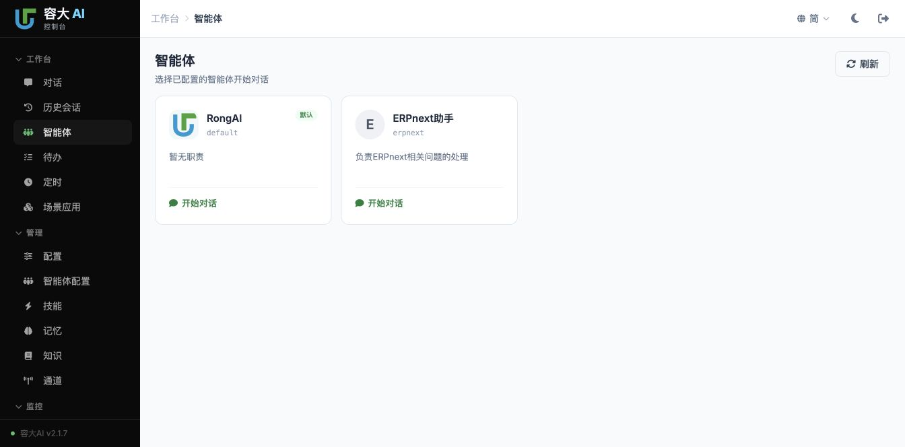
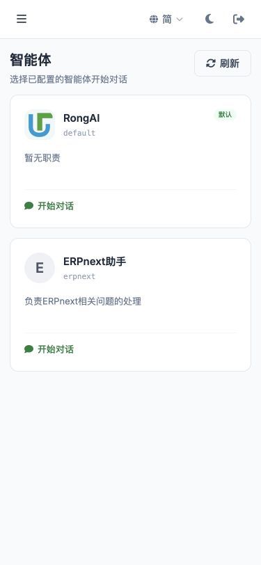
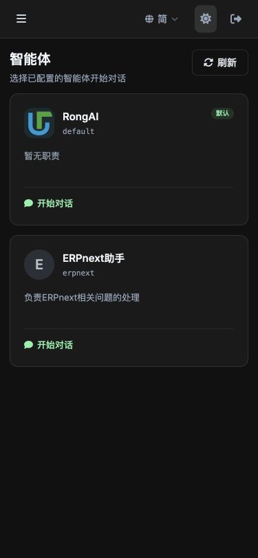

# 独立验收与修复记录

日期：2026-09-08。Change：`split-agent-configuration-and-workbench`。

按用户「验收，包含视觉优化；发现问题直接修复」执行。初验发现实际缺陷，因此没有沿用原任务勾选状态直接判定通过。本记录更新此前 `acceptance-summary.md` 中涉及布局、状态提示与启动保护的结论。

## 结论与适用范围

当前 legacy 部署的菜单拆分、工作台列表、指定智能体聊天、会话恢复及视觉复验通过；发现的问题已在源码修复。最新源码通过 131 项 pytest，其中包含一项运行 15 个 Node 前端行为用例的测试；JavaScript 语法及 OpenSpec 严格校验通过。

浏览器使用 `http://localhost:9899/chat` 的已登录 Chrome 会话。前端每次改动后刷新复验。后端服务明确使用 `autoreload=False`，本轮没有重启当前运行的服务：后端排序与请求上下文修复已经测试，但须在服务下次重启后生效。实际模型回复使用现有运行后端，不能将其当作最新 Python 代码已部署的证明。

database 多租户模式不在本轮通过结论内。工作树正在并行引入身份域代码；租户权限、头像读取和运行关闭策略仍需该模式单独验收。

## 已修复问题

| 问题 | 修复与验证 |
| --- | --- |
| 工作台调用 44px 头像却缺少尺寸样式，默认头像撑满卡片、名称宽度为零 | 增加 `.agent-avatar-44`；宽屏和 375px 页面实测均为 44×44px，名称可见 |
| 默认徽标绝对定位到页面右上角 | 在卡片标题行内定位徽标，保留名称可收缩区域；宽屏徽标完整落在卡片内 |
| 卡片高度不齐、留白与暗色文字层次不足 | 统一内边距、间距与最小高度，改善简介/空简介对比；两张卡片均为 192px 高 |
| 配置页被翻译函数恢复成「智能体团队」 | 简中、繁中、英文标题分别统一为「智能体配置」「智慧體設定」「Agent Config」 |
| 从旧管理缓存判断能否启动，不能启动其他页面新增的智能体，也会接受已删除目标 | 启动前强制读取最新工作台投影；目标缺失或不可运行时可见报错，保留原会话，不回退默认 |
| 启动无法有效防重复、导航离开后可能被迟到响应带回聊天 | 每次启动持有独立请求标记和导航/会话/身份上下文；等待期间禁用卡片，取消或上下文变化后丢弃结果 |
| 校验等待期间新出现的未保存内容可能被丢弃 | 提交前再次执行未保存保护，确认后重新校验；取消不改变目标或会话 |
| 输入框切换智能体先改目标再做未保存保护，并可能继承旧项目 | 输入框切换也复用同一启动函数，只有保护和校验成功才创建目标的新会话，使用目标根空间 |
| 聊天标题只在工作台启动时更新，切换或恢复历史后显示上一智能体 | 统一在身份渲染函数更新聊天标题与头像；真实切换及历史恢复均同步 |
| 旧模型、权限、项目响应可能覆盖新会话 | 新会话清理缓存；刷新响应校验请求的 session 与 agent；历史切换先清理旧显示数据 |
| 全局页面初始化给状态元素添加透明样式，空态和不可用提示实际不可见 | 状态函数主动移除透明类，补充 `role=status`/`aria-live` 和可见样式 |
| 后端按 ID 排序可能把默认项放后面 | legacy 投影默认项优先、其余顺序稳定；租户投影同样默认优先；增加默认 ID 排在字母序末尾的用例 |
| 切换语言后动态卡片仍显示旧语言；远端更新头像后缓存不失效 | 切换语言重绘卡片，刷新名单同步更新图片缓存版本 |
| 当前接口集成中的 `_db_scope` 为 generator，无法用于 `with` | 补齐 `@contextmanager`，修复工作台及关联读取接口的上下文异常；回归通过 |

## 浏览器复验

| 场景 | 结果 |
| --- | --- |
| 导航 | 工作台「智能体」与管理「智能体配置」独立激活；配置标题、面包屑一致；保留现有独立历史会话入口 |
| 宽屏 1344×664 | 头像 44px；卡片宽 262.5px、高 192px；默认项名称宽 119.5px；徽标在卡片标题行内 |
| 窄屏 375×812 | 卡片单列，宽 347px、高 192px；名称区域有足够宽度；文档宽度 375px，无横向溢出 |
| 深色/浅色 | 宽屏及窄屏均目视检查，头像、边框、按钮与简介可读 |
| 语言 | 简中、英文、繁中来回切换，标题、刷新、默认徽标、空简介和启动动作即时更新；用户配置的名称/简介保留原文 |
| 键盘 | 从刷新按钮 Tab 到默认智能体；出现 2px 焦点框；回车进入聊天且输入框获焦 |
| 真实启动与回复 | 点击 ERPnext助手进入空白聊天；发送无业务操作测试消息；收到「验收通过」回复，没有工具调用显示 |
| 切换与恢复 | 输入框切换后标题、头像同步；从历史打开「验收通过」恢复 ERPnext助手及实际消息；原 RongAI 历史可正常恢复 |
| 配置兼容 | 配置页现有表单、概况/能力/核心文件、保存和开始对话入口仍在；本轮未修改真实智能体配置 |
| 浏览器错误 | 最终流程浏览器错误日志为空 |

测试消息内容：「界面验收测试，请只回复‘验收通过’，不要调用工具，也不要修改文件或配置。」保留了这条验收会话，没有删除用户历史。结束时已恢复简中、浅色、原始窗口尺寸和原 RongAI 会话。

空态、网络错误重试、运行关闭、目标删除、跨上下文迟到响应、单智能体身份等异常条件通过受控 Node 行为测试验证；没有通过修改真实 Agent 或浏览器注入来构造这些状态，也不把它们称为真实运行模式验收。长文本截断规则有代码检查，本轮真实配置的名称较短，未造长文本配置。

## 自动化验证

```sh
node --check channel/web/static/js/console.js
node --test tests/test_agent_workbench_frontend.cjs
.venv/bin/python -m pytest -q tests/test_agent_workbench.py tests/test_agent_web_management.py tests/test_agent_admin.py tests/test_agent_registry.py tests/test_agent_routing.py tests/test_multi_agent_state_isolation.py tests/test_workspace_edit.py tests/test_doc_edit.py
openspec validate split-agent-configuration-and-workbench --strict
```

结果：语法检查通过；15/15 Node 用例通过；131/131 pytest 通过；OpenSpec strict 通过。Node 用例运行实际源码函数，使用受控传输和最小 DOM，补足原先仅检查源码字符串无法验证的时序行为；实际 CSS/浏览器渲染由上表人工复验覆盖。

## 截图







本轮只追加验收修复及证据，不归档 change，不提交或清理共享工作树中的其他改动。
