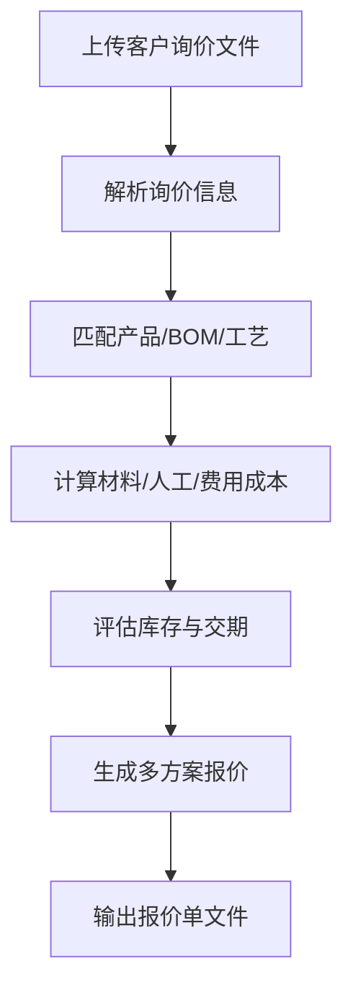

# 销售智能报价

面向制造业销售部门的智能报价工具。根据客户询价信息、企业 BOM/工艺/成本数据和 ERP 库存/采购价，自动完成成本核算、报价策略建议和报价单生成。

## 功能概述

1. **多格式询价解析**：支持 PDF、Word、Excel、图片 OCR、文本描述的询价单解析
2. **产品/BOM 匹配**：识别客户所需产品规格，关联企业内部 BOM、工艺路线、工时定额
3. **成本自动核算**：材料成本 + 人工成本 + 制造费用 + 管理费用分摊
4. **多方案报价**：标准方案 / 经济型方案 / 高配方案，含数量阶梯价
5. **利润测算**：毛利率、净利率、盈亏平衡量
6. **交期评估**：结合库存、产能、采购周期给出可承诺交期
7. **标准报价单输出**：Excel 报价单 + Word 报价书

## 输入数据要求

### 客户询价信息（必填）

| 字段 | 说明 | 来源 |
|---|---|---|
| 客户名称 | 客户档案 | 用户输入 / CRM |
| 产品名称/型号 | 客户所需产品 | 询价文件 / 用户输入 |
| 规格参数 | 尺寸、材质、性能要求等 | 询价文件 / 图纸 |
| 需求量 | 本次询价数量 | 询价文件 |
| 目标交期 | 客户希望交付时间 | 询价文件 |
| 付款方式 | 预付、月结、信用证等 | 询价文件 / 用户输入 |

### 企业内部数据（可选，对接 ERP/PLM）

| 字段 | 说明 | 来源 |
|---|---|---|
| BOM 清单 | 物料编码、用量、损耗率 | ERP/PLM |
| 材料单价 | 最近采购价 / 标准价 | ERP |
| 工艺路线 | 工序、设备、标准工时 | PLM/MES |
| 人工费率 | 各工序小时人工费 | 财务 |
| 制造费用率 | 设备折旧、能耗、辅料分摊 | 财务 |
| 库存数据 | 原材料 / 半成品 / 成品库存 | ERP |
| 产能负荷 | 设备可用产能、在制订单 | MES/PMC |

### 上传模板文件

所有模板位于 `assets/upload_templates/`，用户可下载后按格式填写上传：

| 模板文件 | 用途 | 关键字段 |
|---|---|---|
| `客户询价文件示例.txt` | 非结构化询价单参考格式 | 客户名称、产品名称、规格、数量、交期、付款方式 |
| `产品BOM模板.xlsx` | 产品物料清单 | 物料编码、物料名称、规格型号、用量、单位、单价、损耗率(%) |
| `工艺路线模板.xlsx` | 生产工序与工时 | 工序、设备、工时(小时)、人工费率(元/小时)、制造费用率(元/小时) |
| `库存数据模板.xlsx` | 原材料库存情况 | 物料编码、物料名称、当前库存、可用库存、在途数量、安全库存 |
| `产能负荷模板.xlsx` | 设备产能情况 | 工序、设备、日产能(件)、已排产(件)、剩余产能(件) |
| `成本费率配置.json` | 管理费率与利润率 | admin_rate、profit_rates、payment_risk |

## 核心工作流程



## 脚本说明

### parse_inquiry.py - 询价信息解析

**功能**：从 PDF/Word/Excel/图片/文本中提取客户询价关键字段。采用混合解析策略：
- **结构化 Excel**：优先使用 pandas 按表头别名快速解析，成本低、速度快、结果稳定
- **非结构化 PDF/Word/文本**：使用正则提取；提取失败时可启用 `--use-llm` 调用 LLM 兜底
- **已解析 JSON**：通过 `--input-json` 直接传入上游（如 Agent/LLM）解析好的结构化数据

**参数**：
- `--input`: 询价文件路径
- `--input-json`: 已解析的询价 JSON 文件路径（与 `--input` 二选一）
- `--output`: 解析结果 JSON 输出路径（默认：`tmp/inquiry_parsed.json`）
- `--ocr`: 是否启用 OCR（图片/PDF 扫描件时设置）
- `--use-llm`: 正则提取失败时启用 LLM 兜底（预留接口）

**输出 JSON 结构**：
```json
{
  "customer": "客户A",
  "product_name": "电机壳体",
  "specifications": {"material": "铝合金", "size": "Φ120×80mm"},
  "quantity": 1000,
  "target_delivery": "2026-08-15",
  "payment_terms": "月结30天",
  "special_requirements": ["表面阳极氧化", "公差±0.05mm"]
}
```

### calculate_cost.py - 成本核算

**功能**：基于 BOM、工艺、费率计算产品成本

**参数**：
- `--inquiry`: 解析后的询价 JSON
- `--bom`: BOM 数据文件（JSON/Excel）
- `--process`: 工艺路线文件
- `--rates`: 成本费率配置文件
- `--output`: 成本核算结果输出路径（默认：`tmp/cost_calculation.json`）

**成本构成**：
```
直接材料成本 = Σ(物料用量 × 材料单价 × (1 + 损耗率))
直接人工成本 = Σ(工序工时 × 人工费率)
制造费用     = Σ(工序工时 × 制造费用率)
管理费用分摊 = (直接材料 + 直接人工 + 制造费用) × 管理费率
总成本       = 直接材料 + 直接人工 + 制造费用 + 管理费用分摊
```

### generate_quotation.py - 报价单生成

**功能**：生成 Excel/Word/HTML 格式报价单。其中 HTML 为可视化看板，包含成本构成饼图、报价方案对比图、成本明细表，适用于聊天框中直接展示。

**参数**：
- `--inquiry`: 询价解析结果
- `--cost`: 成本核算结果
- `--delivery`: 交期评估结果
- `--template`: 报价单模板路径
- `--output`: 输出文件路径
- `--format`: 输出格式（`excel`、`word` 或 `html`，默认 `excel`）

### evaluate_delivery.py - 交期评估

**功能**：结合库存、产能、采购周期评估可承诺交期

**参数**：
- `--inquiry`: 询价解析结果
- `--inventory`: 库存数据文件
- `--capacity`: 产能负荷数据
- `--output`: 交期评估结果

## 报价策略规则

### 毛利率档位

| 客户类型 | 建议毛利率 | 备注 |
|---|---|---|
| 战略客户 | 8%-12% | 长期合作、批量大 |
| 普通客户 | 15%-20% | 标准产品、正常交期 |
| 新客户首单 | 12%-18% | 需考虑开发成本 |
| 定制/急单 | 20%-30% | 含加急费和研发分摊 |

### 数量阶梯价

| 数量区间 | 价格系数 |
|---|---|
| 1-99 件 | 1.15 |
| 100-499 件 | 1.08 |
| 500-999 件 | 1.04 |
| 1000 件以上 | 1.00 |

### 付款方式调整

| 付款方式 | 价格系数 |
|---|---|
| 预付 30%，发货前付清 | 0.98 |
| 月结 30 天 | 1.00 |
| 月结 60 天 | 1.02 |
| 月结 90 天 | 1.05 |

## AI 执行步骤（必须按此顺序执行）

当用户需要销售报价、核算成本、生成报价单或评估订单利润时，按以下步骤执行。禁止跳过任何步骤，禁止从零编写 Python 脚本，必须调用本技能包提供的脚本。

### 步骤 1：解析客户询价文件

读取用户上传的询价文件，提取客户名称、产品名称、规格、需求量、目标交期、付款方式等关键信息。

```bash
python skills/sales-quotation/scripts/parse_inquiry.py \
  --input "<用户上传的询价文件路径>" \
  --output tmp/inquiry_parsed.json
```

- 支持格式：PDF / Word / Excel / 文本 / Markdown
- 如果用户没有上传询价文件但提供了结构化信息，可直接写入 `tmp/inquiry_parsed.json`

### 步骤 2：核算产品成本

结合企业 BOM、工艺路线和成本费率，计算直接材料、直接人工、制造费用和管理费用分摊。

```bash
python skills/sales-quotation/scripts/calculate_cost.py \
  --inquiry tmp/inquiry_parsed.json \
  --bom "<用户上传的BOM文件路径>" \
  --process "<用户上传的工艺路线文件路径>" \
  --rates "<用户上传的成本费率配置文件路径>" \
  --output tmp/cost_calculation.json
```

- 如果用户未上传 BOM/工艺/费率文件，使用 `skills/sales-quotation/assets/upload_templates/` 下的模板作为示例数据
- 必须保证 `--inquiry` 参数指向步骤 1 生成的 `tmp/inquiry_parsed.json`

### 步骤 3：评估可承诺交期（可选但建议执行）

如果用户上传了库存和产能数据，评估是否能满足目标交期。

```bash
python skills/sales-quotation/scripts/evaluate_delivery.py \
  --inquiry tmp/inquiry_parsed.json \
  --inventory "<用户上传的库存数据文件路径>" \
  --capacity "<用户上传的产能负荷文件路径>" \
  --output tmp/delivery_evaluation.json
```

- 库存和产能文件支持 Excel / JSON
- 如果用户未上传，可跳过此步骤，在步骤 4 中不传 `--delivery` 参数

### 步骤 4：生成报价单

必须同时生成 Excel 报价单和 HTML 可视化看板。HTML 看板用于在聊天框中直接展示。

```bash
# 生成 Excel 报价单
python skills/sales-quotation/scripts/generate_quotation.py \
  --inquiry tmp/inquiry_parsed.json \
  --cost tmp/cost_calculation.json \
  --delivery tmp/delivery_evaluation.json \
  --output tmp/quotation_result.xlsx \
  --format excel

# 生成 HTML 可视化看板
python skills/sales-quotation/scripts/generate_quotation.py \
  --inquiry tmp/inquiry_parsed.json \
  --cost tmp/cost_calculation.json \
  --delivery tmp/delivery_evaluation.json \
  --output tmp/quotation_result.html \
  --format html
```

- 如果未执行步骤 3，省略 `--delivery` 参数
- HTML 看板包含成本构成饼图、报价方案对比图、成本明细表

### 步骤 5：向用户汇报

1. 简要说明客户询价的关键信息
2. 展示成本核算结果和三种报价方案（经济型/标准型/高配型）
3. 说明毛利率、交期评估和风险提示
4. 提供文件路径：
   - Excel 报价单：`tmp/quotation_result.xlsx`
   - HTML 可视化看板：`tmp/quotation_result.html`

## 关键约定

- **禁止从零编写 Python 脚本**，所有计算必须调用本技能包脚本
- **计算逻辑必须保持纯 Python**，不允许让 LLM 直接计算成本或利润
- 所有脚本路径必须使用 `skills/sales-quotation/scripts/` 下的文件
- 中间结果文件统一放在 `tmp/` 目录
- HTML 输出文件用于聊天框展示，Excel 输出文件用于下载

## 输出结果

### 1. 成本核算明细

| 成本项目 | 金额（元） | 占比 |
|---|---|---|
| 直接材料 | 45.00 | 60% |
| 直接人工 | 12.00 | 16% |
| 制造费用 | 10.00 | 13% |
| 管理费用分摊 | 8.00 | 11% |
| **合计成本** | **75.00** | **100%** |

### 2. 报价方案

| 方案 | 单价（元） | 数量 | 总价（元） | 毛利率 | 备注 |
|---|---|---|---|---|---|
| 经济型 | 85.00 | 1000 | 85,000 | 11.8% | 低价策略，快速占领市场 |
| 标准型 | 92.00 | 1000 | 92,000 | 18.5% | 推荐方案 |
| 高配型 | 100.00 | 1000 | 100,000 | 25.0% | 含加急交付和质量保障 |

### 3. 报价单文件

- Excel 报价单：含公司抬头、客户信息、产品明细、价格、交期、付款方式、有效期
- Word 报价书：含技术方案、服务承诺、公司资质、商务条款
- HTML 可视化看板：含成本构成饼图、报价方案对比图、成本明细表，可直接在聊天框中展示

## 使用示例

```bash
# 1. 解析询价单
python scripts/parse_inquiry.py --input "客户询价单.pdf" --output tmp/inquiry_parsed.json

# 2. 核算成本
python scripts/calculate_cost.py --inquiry tmp/inquiry_parsed.json --bom data/bom.xlsx --process data/process.xlsx --rates data/rates.json --output tmp/cost_calculation.json

# 3. 评估交期
python scripts/evaluate_delivery.py --inquiry tmp/inquiry_parsed.json --inventory data/inventory.xlsx --capacity data/capacity.json --output tmp/delivery_evaluation.json

# 4. 生成 Excel 报价单
python scripts/generate_quotation.py --inquiry tmp/inquiry_parsed.json --cost tmp/cost_calculation.json --delivery tmp/delivery_evaluation.json --template assets/quotation_template.xlsx --output output/报价单_客户A_20260705.xlsx

# 5. 生成 HTML 可视化看板（聊天框展示）
python scripts/generate_quotation.py --inquiry tmp/inquiry_parsed.json --cost tmp/cost_calculation.json --delivery tmp/delivery_evaluation.json --output output/报价单_客户A_20260705.html --format html
```

## 数据对接建议

### ERP 对接字段

| 系统 | 接口 | 数据 |
|---|---|---|
| SAP | `AUFK`/`RESB` | 生产订单、BOM |
| U9 | `/api/Product/BOM` | 产品 BOM |
| 金蝶 | `/k3cloud/Product/Bom` | 物料清单 |
| 用友 | `/yonbip/mfg/bom` | 工艺路线 |

### 无 ERP 对接时的处理

如果客户没有 ERP 接口，支持用户上传以下 Excel 模板：
- `bom_template.xlsx`：物料编码、名称、用量、损耗率、单价
- `process_template.xlsx`：工序、设备、工时、人工费率、制造费用率
- `inventory_template.xlsx`：物料库存、可用量

## 注意事项

1. **成本数据准确性**：材料单价建议使用最近采购价或移动平均价，避免用陈旧标准价
2. **损耗率**：不同行业差异大，建议按产品类别配置默认损耗率
3. **毛利率参考**：默认策略仅供参考，最终报价需销售结合客户关系调整
4. **有效期**：报价单默认有效期 30 天，可在模板中调整
5. **币种**：默认人民币，支持美元/欧元（需配置汇率）

## 目录结构

```
sales-quotation/
├── SKILL.md                          # 技能主文档
├── scripts/
│   ├── parse_inquiry.py              # 询价单解析
│   ├── calculate_cost.py             # 成本核算
│   ├── evaluate_delivery.py          # 交期评估
│   └── generate_quotation.py         # 报价单生成
└── assets/
    ├── quotation_template.xlsx       # Excel 报价单模板
    ├── quotation_template.docx       # Word 报价书模板
    ├── bom_template.xlsx             # BOM 数据上传模板
    ├── process_template.xlsx         # 工艺路线上传模板
    └── inventory_template.xlsx       # 库存数据上传模板
```

## 依赖安装

```bash
pip install python-docx openpyxl pandas pdfplumber pillow
```

## 版本历史

- **v1.0.0**：初始版本，支持询价解析、成本核算、多方案报价、报价单生成
